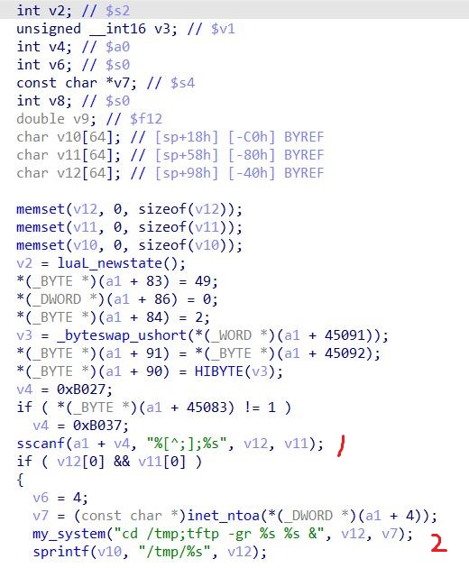

# Archer A7(US)_V5_210519 tddp os command injection

TP-Link Archer A7 AC1750 Firmware: Archer A7(US)_V5_210519 is affected by an os command injection vulnerability. This vulnerability is fixed in Archer A7(US)_V5_211022.

## Description

In the function at 401EA0, at label 2, the program passes parameters for the tftp command, while at label 1, only ';' is filtered. The attacker can use '||' to separate the command and inject dangerous commands.

