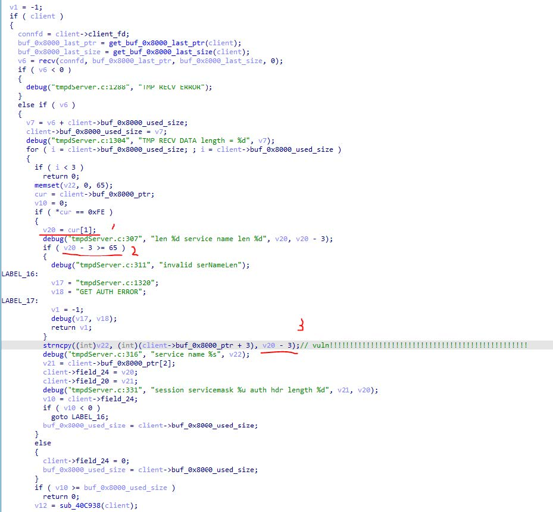

# Archer A7(US)_V5_210519 tmpServer integer overflow

TP-Link Archer A7 AC1750 Firmware: Archer A7(US)_V5_210519 is affected by an integer overflow vulnerability. This vulnerability is fixed in Archer A7(US)_V5_211022.

## Description

In the function at sub_40C9C4, First, the program calls `recv`, and extracts `v20` at label 1, and the value range of v20 is [0, 255]. At label 3, use `v20 – 3` as the third parameter of the `strncpy`. When `v20` < 3, the result of `v20 – 3` is a 4 Bytes signed negative integer. When it converted to an unsigned integer, the result is a huge positive number greater than 4 billion. It causes the program to copy a large amount of data to the stack until it points into kernel space, then crash. At label 2, the program only checks whether the result of `v20 - 3` has passed is too large, but do not check whether it is negative.

